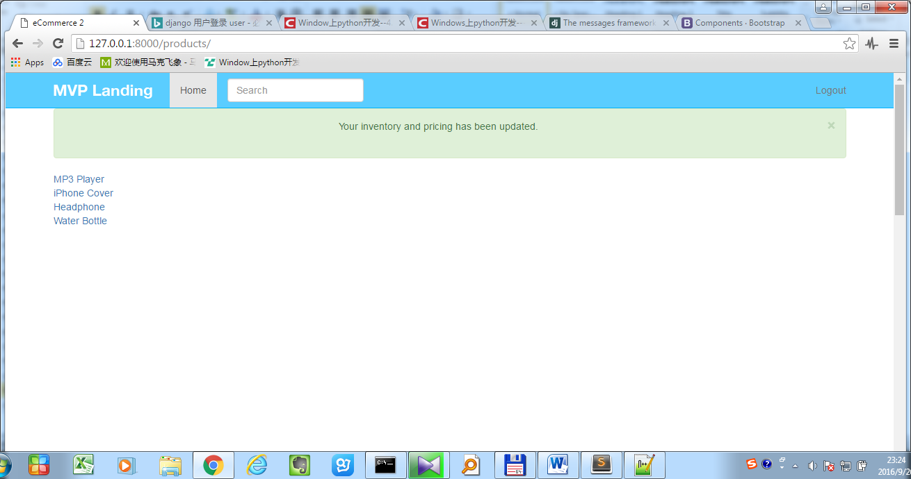

# Introduction

# Walkthrough

# Requirement

Tool

Braintree : 支付

Sublime

# 004 Setup a previous project

从github repository拿到trydjango的git地址git@github.com:navicester/trydjango18course.git

或者https://github.com/codingforentrepreneurs/ecommerce-2

## 克隆基础项目
``` dos
>git clone git@github.com:navicester/trydjango18course.git
```
`virtualenv .` 试了一下不工作，还是回到父目录执行

## 安装request组件
``` dos
>pip install requests[security] 有时安装不成功
>pip freeze
```
> 
<pre>
cffi==1.8.3
cryptography==1.5.1
enum34==1.1.6
idna==2.1
ipaddress==1.0.17
ndg-httpsclient==0.4.2
pyasn1==0.1.9
pycparser==2.14
pyOpenSSL==16.1.0
requests==2.11.1
six==1.10.0
</pre>

``` python
>pip install -r requirements.txt
```

## 更新django到1.8版本
``` python
>pip install django==1.8.4
>pip install django-registration-redux  --upgrade
```

## 更新安装组件
``` python
>pip freeze > requirements.txt
```

## 删除老的数据库
``` dos
>rm db.sqlite3
```

## 数据库迁移
``` dos
>python manage.py migrate
```

## 创建超级用户
``` python
>python manage.py createsuperuser
```

# 005 Trydjano18 to ecommerce
将文件里的trydjango18全部替换成ecommerce2，并添加新的git repository

Trydjango18目录改成ecommerce2
``` dos
>rm -rf .git 切记
git init
git remote add origin git@github.com:navicester/ecommerce2course.git
git add .
git push -u origin master
```

# 006 Project Roadmap

# 007 Product App
添加Product application
- 创建app `python manage.py startapp *app_name*`
- 定义Product类 (Model)
- 在settings里的INSTALLED_APPS添加这个新加的APP
- 添加Admin接口

之后会实现各个子功能
- DetaiView
 - 008 定义ProductDetailView (View)
 - 009 添加ProductDetailView入口 (url)
 - 010 实现模板 (template)

- ListView
 - 011 添加ProductListView (View), 模板(template), 入口 (url)
 - 012 模板里添加直接访问Model实例的链接 (get_absolute_url)
 - 013 定制Model queryset (Model Manager)
- Variation
 - 014 定义Variation (model)，添加admin，更新Product模板添加Variation选项(template)
 - 015 Product保存时，如果没有型号，则添加一个默认型号 (Post Save)
- Product Vew Layout
 - 016 分为两列，左边(`col-sm-8`)显示title，description，右边显示Variation
 - 017 图片上传功能 (image)
 - 018 搜索功能 (search)
 - 019 库存显示功能，应用(ModelFormset)功能
 - 020 库存登录才能访问，(LoginRequiredMixin)
 - 021 消息 (Message)
 - 022 分享
 - 023 动态更新价格 (Jquery)


创建app
``` dos
>python manage.py startapp product
```

在products.models添加product类
``` python
from django.db import models

# Create your models here.
class Product(models.Model):
	title = models.CharField(max_length=120)
	description = models.TextField(blank=True, null=True)
	price = models.DecimalField(decimal_places=2, max_digits=20)
	active = models.BooleanField(default=True)

	def __unicode__(self): #def __str__(self):
		return self.title
```

settings里添加products
``` python
INSTALLED_APPS = (
    'django.contrib.admin',
    'django.contrib.auth',
    'django.contrib.contenttypes',
    'django.contrib.sessions',
    'django.contrib.messages',
    'django.contrib.sites',
    'django.contrib.staticfiles',
	'newsletter',
    'products',
    'crispy_forms',
    'registration',
)
```
数据库迁移
``` dos
>python manage.py makemigrations
>python manage.py migrate
```

添加admin接口. `products.admin.py`
``` python
from .models import Product

# Register your models here.
admin.site.register(Product)
```

# 008 Product Detail View
创建Product Detail View,包含
- 从DetailView继承，并设置model
- 指定template/context, 并渲染render

更新*products.views*，创建ProductDetailView，并指定template和context （测试用）
``` python
from django.views.generic.detail import DetailView
from .models import Product

# Create your views here.
class ProductDetailView(DetailView):
	model = Product

def product_detail_view_func(request, id):
	product_instance = Product.objects.get(id=id)

	template = "products/product_detail.html"
	context = {	
		"object": product_instance
	}
	return render(request, template, context)
```
http://127.0.0.1:8000/products/1/

## 参考
https://docs.djangoproject.com/en/1.8/ref/class-based-views/generic-display/#detailview

Generic display views
- DetailView
- ListView

**class django.views.generic.detail.DetailView**
<pre>
While this view is executing, self.object will contain the object that the view is operating upon.
This view inherits methods and attributes from the following views:

•	django.views.generic.detail.SingleObjectTemplateResponseMixin
•	django.views.generic.base.TemplateResponseMixin
•	django.views.generic.detail.BaseDetailView
•	django.views.generic.detail.SingleObjectMixin
•	django.views.generic.base.View

Method Flowchart
1.	dispatch()
2.	http_method_not_allowed()
3.	get_template_names()
4.	get_slug_field()
5.	get_queryset()
6.	get_object()
7.	get_context_object_name()
8.	get_context_data()
9.	get()
10.	render_to_response()
</pre>

**class django.views.generic.base.View**
<pre>
dispatch(request, *args, **kwargs)
	The view part of the view – the method that accepts a request argument plus arguments, and returns a HTTP response.
	The default implementation will inspect the HTTP method and attempt to delegate to a method that matches the HTTP method; a GET will be delegated to get(), a POST to post(), and so on.
	By default, a HEAD request will be delegated to get(). If you need to handle HEAD requests in a different way thanGET, you can override the head() method. See Supporting other HTTP methods for an example.

http_method_not_allowed(request, *args, **kwargs)
	If the view was called with a HTTP method it doesn’t support, this method is called instead.
	The default implementation returns HttpResponseNotAllowed with a list of allowed methods in plain text.
</pre>

class django.views.generic.base.TemplateResponseMixin
<pre>
get_template_names()
	Returns a list of template names to search for when rendering the template.
	If template_name is specified, the default implementation will return a list containing template_name (if it is specified).
render_to_response(context, **response_kwargs)¶
	Returns a self.response_class instance.
	If any keyword arguments are provided, they will be passed to the constructor of the response class.
	Calls get_template_names() to obtain the list of template names that will be searched looking for an existent template.
</pre>

class django.views.generic.detail.SingleObjectMixin
<pre>
get_slug_field()
	Returns the name of a slug field to be used to look up by slug. By default this simply returns the value of slug_field.
get_queryset()
	Returns the queryset that will be used to retrieve the object that this view will display. By default, get_queryset()returns the value of the queryset attribute if it is set, otherwise it constructs a QuerySet by calling the all()method on the model attribute’s default manager.
get_object(queryset=None)
	Returns the single object that this view will display. If queryset is provided, that queryset will be used as the source of objects; otherwise, get_queryset() will be used. get_object() looks for a pk_url_kwarg argument in the arguments to the view; if this argument is found, this method performs a primary-key based lookup using that value. If this argument is not found, it looks for a slug_url_kwarg argument, and performs a slug lookup using the slug_field.
get_context_object_name(obj)
	Return the context variable name that will be used to contain the data that this view is manipulating. Ifcontext_object_name is not set, the context name will be constructed from the model_name of the model that the queryset is composed from. For example, the model Article would have context object named 'article'.
get_context_data(**kwargs)
	Returns context data for displaying the list of objects.
	The base implementation of this method requires that the self.object attribute be set by the view (even if None). Be sure to do this if you are using this mixin without one of the built-in views that does so.
	It returns a dictionary with these contents:
	•	object: The object that this view is displaying (self.object).
	•	context_object_name: self.object will also be stored under the name returned byget_context_object_name(), which defaults to the lowercased version of the model name.
</pre>

[class django.views.generic.list.ListView](https://docs.djangoproject.com/en/1.8/ref/class-based-views/generic-display/#django.views.generic.list.ListView)
<pre>
A page representing a list of objects.
While this view is executing, self.object_list will contain the list of objects (usually, but not necessarily a queryset) that the view is operating upon.
Ancestors (MRO)
This view inherits methods and attributes from the following views:
•	django.views.generic.list.MultipleObjectTemplateResponseMixin
•	django.views.generic.base.TemplateResponseMixin
•	django.views.generic.list.BaseListView
•	django.views.generic.list.MultipleObjectMixin
•	django.views.generic.base.View

Method Flowchart
1.	dispatch()
2.	http_method_not_allowed()
3.	get_template_names()
4.	get_queryset()
5.	get_context_object_name()
6.	get_context_data()
7.	get()
8.	render_to_response()
</pre>

# 009 url with django app
实现DetailView的显示，其通过测试函数分解其功能

https://github.com/codingforentrepreneurs/Guides/blob/master/all/common_url_regex.md

在ecommerce2.url添加入口
``` python
    url(r'^products/', include('products.urls')),       
```

新建文件products.url
其中, `as_view`将class based view转换为function based view
`P<id>`这个跟view里面的参数是一致的
``` python
from django.conf import settings
from django.conf.urls import include, url
from django.conf.urls.static import static
from django.contrib import admin

from .views import ProductDetailView

urlpatterns = [
    # Examples:
    url(r'^(?P<pk>\d+)/$', ProductDetailView.as_view(), name='product_detail'),
    #url(r'^(?P<id>\d+)', 'products.views.product_detail_view_func', name='product_detail_function'),
]
```

# 010 Add html templates
创建*products/templates/products/product_detail.htnl*

DetailView的默认名字是`template_name = "<appname>/<modelname>_detail.html"`

可以通过更新这个名字来修改template位置

http://127.0.0.1:8000/products/1/
可以访问刚刚创建的product

如果访问的数据越界了，需要做一些处理
``` python
-from django.shortcuts import render
+from django.shortcuts import render, get_object_or_404
+from django.http import Http404

def product_detail_view_func(request, id):
-    product_instance = Product.objects.get(id=id)
+	product_instance = get_object_or_404(Product, id=id)
+	try:
		product_instance = Product.objects.get(id=id)
+	except Product.DoesNotExist:
+		raise Http404
+	except:
+		raise Http404

	template = "products/product_detail.html"
	context = {	
		"object": product_instance
	}

	return render(request, template, context)
```

# 011 ListView
https://docs.djangoproject.com/en/1.8/ref/class-based-views/generic-display/#listview

ProductListView实现
- 添加入口 (url), **ListView.as_view()
- 添加ProductListView，从ListView继承
- 添加模板

更新products.urls
``` python
-from .views import ProductDetailView
+from .views import ProductDetailView, ProductListView

urlpatterns = [
    # Examples:
+    url(r'^$', ProductListView.as_view(), name='products'),
]
```
访问地址
http://127.0.0.1:8000/products/

更新products.views，添加listview的处理
``` python
from django.views.generic.list import ListView
from django.utils import timezone

class ProductListView(ListView):
    model = Product

    def get_context_data(self, *args, **kwargs):
        context = super(ProductListView, self).get_context_data(*args, **kwargs)
        context["now"] = timezone.now()
        return context
```

添加*products/templates/products/product_list.html*
``` html




<table>
	
	<tr>
		<td>{{object.title}}</td>
	</tr>
	

</table>

```

# 012 Using Links for Model Instance

实现：模板里添加直接访问Model实例的链接 (get_absolute_url)

*Products/templates/products/product_list.html*
``` html
<td><a href="/products/{{object.pk}}/">{{object.title}}</a></td>
<td><a href="">{{object.title}}</a></td>
```

可以用下面的方式
``` html
<td><a href="{{ object.get_absolute_url }}">{{object.title}}</a></td>
```

更新models
``` python
from django.core.urlresolvers import reverse

class Product(models.Model):

	def get_absolute_url(self):
		return reverse("product_detail", kwargs={"pk": self.pk})
```

# 013 Model Manager

实现：定制化model queryset, 过滤model里面的一些objects

https://docs.djangoproject.com/en/1.10/topics/db/managers/

Model里添加Model Manager
``` python
class ProductQuerySet(models.query.QuerySet):
	def active(self):
		return self.filter(active=True)


class ProductManager(models.Manager):
	def get_queryset(self):
		return ProductQuerySet(self.model, using=self._db)

	def all(self, *args, **kwargs):
		return self.get_queryset().active()

class Product(models.Model):
	title = models.CharField(max_length=120)
	description = models.TextField(blank=True, null=True)
	price = models.DecimalField(decimal_places=2, max_digits=20)
	active = models.BooleanField(default=True)

+	objects = ProductManager()
```

view里更新queryset
``` python
class ProductListView(ListView):
    model = Product
+    queryset = Product.objects.all()
```

# 014 Product Variation
实现：添加产品型号
- 定义Variation (model)
- 添加admin接口
- 更新模板，添加Variation选项

添加类variation，文件products.models
``` python
class Variation(models.Model):
	product = models.ForeignKey(Product)
	title = models.CharField(max_length=120)
	price = models.DecimalField(decimal_places=2, max_digits=20)
	sale_price = models.DecimalField(decimal_places=2, max_digits=20, null=True, blank=True)
	active = models.BooleanField(default=True)
	inventory = models.IntegerField(null=True, blank=True) #refer none == unlimited amount

	def __unicode__(self):
		return self.title

	def get_price(self):
		if self.sale_price is not None:
			return self.sale_price
		else:
			return self.price

	def get_absolute_url(self):
		return self.product.get_absolute_url()
```

添加admin接口
``` python
from .models import Variation
admin.site.register(Variation)
```

更新ProductDetail
``` html
<select class='form-control'>
	
	<option value = "{{vari_obj.id}}">
		{{vari_obj}}
	</option>
	
</select>
```

更新一些css符合commerce的风格

# 015 Post Save Signal for Variation
https://docs.djangoproject.com/en/1.8/ref/signals/#post-save

实现：Post Save，新建一个product时，如果没有variation，那么创建一个default的variation

如果产品保存是没有型号variation，则自动创建一个

在model添加post save处理
新建一个product时，如果没有variation，那么创建一个default的variation
``` python
def product_post_saved_receiver(sender, instance, created, *args, **kwargs):
	product = instance
	variations = product.variation_set.all()
	if variations.count() == 0:
		new_var = Variation()
		new_var.product = product
		new_var.title = "Default"
		new_var.price = product.price
		new_var.save()

post_save.connect(product_post_saved_receiver, sender=Product)
```

在*template product_detail.html*过滤掉默认创建的variation
``` html
+
	<select class='form-control'>    
		
		<option value = "{{vari_obj.id}}">
			{{vari_obj}}
		</option>
		
	</select>
+
<br/>
+<a href="#">Add to Cart</a>
```

# 016 Project Detail Layout
实现：分为两栏，左边是描述，右边是Variation
``` html
+<div class="row">
+	<div class="col-sm-8"> 
		<h2>{{object.title}}</h2>
+		<p class="lead">
+			{{object.description}}
+		</p>
+	</div>

+<div class="col-sm-4">
+	<h3>{{object.price}}</h3>
	
		<select class='form-control'>    
			
			<option value = "{{vari_obj.id}}">
				{{vari_obj}}
			</option>
			
		</select>
	
	<br/>
	<hr/>
+	<h4>Related Products</h4>
	<a href="#">Add to Cart</a>
+</div>

```

# 017 Image Uploads

https://github.com/codingforentrepreneurs/Guides/blob/master/all/imagefield_and_pillow.md

实现：图片上传功能

pillow是python image库
``` dos
>pip install pillow
```

创建ProductImage类 (product.models)

其中，存放路径在`MEDIA_ROOT = os.path.join(os.path.dirname(BASE_DIR), "static_in_env", "media_root")`

子目录可以自定义

这儿有2个文件iphone_cover.jpg，mp3_player.jpg分别传给Product里面的iPhone Cover和MP3 Player
``` python
from django.utils.text import slugify

def image_upload_to(instance, filename):
	title = instance.product.title
	slug = slugify(title)
	basename, file_extension = filename.split(".")
	new_filename = "%s-%s.%s" %(slug, instance.id, file_extension)
	return "products/%s/%s" %(slug, new_filename)
```

比如上传的文件名名为iphone_cover.jpg，为iPhone Cover model添加ProductImage

则title, slug, basename, file_extension, new_filename的值分别如下：

[iPhone Cover] [iphone-cover] [iphone_cover] [jpg] [iphone-cover-2.jpg]

如果是第一次创建ProductImage，instance.id为None
<pre>
MP3 Player mp3-player mp3_player jpg mp3-player-None.jpg
MP3 Player mp3_player.jpg
</pre>
同样的名字，如果做第二次修改
<pre>
MP3 Player mp3-player mp3_player jpg mp3-player-3.jpg
MP3 Player mp3_player.jpg
Currently: products/mp3-player/mp3-player-3.jpg 
</pre>
同样的名字，如果继续覆盖，文件不会被覆盖，而是增加随机数重新拷贝一个
<pre>
MP3 Player mp3-player mp3_player jpg mp3-player-3.jpg
MP3 Player mp3_player.jpg
Currently: products/mp3-player/mp3-player-3_7KveE47.jpg 
</pre>

入参instance和filename分别为
iPhone Cover iphone_cover.jpg
filename为上传文件的文件名
``` python
class ProductImage(models.Model):
	product = models.ForeignKey(Product)
	image = models.ImageField(upload_to=image_upload_to)

	def __unicode__(self):
		return self.product.title
```

``` dos
>python manage.py makemigrations
>python manage.py migrate
```

创建admin接口
``` python
from .models import Product,Variation,ProductImage

admin.site.register(ProductImage)
```

在product_detail_view添加图片显示

下面这两个的显示分别如下
> 
<pre>
			{{ img.image.file }}
			{{ img.image.url }}
</pre>

结果为:
> 
<pre>
D:\virtualenv\ecommerce-ws\src\static_in_env\media_root\products\mp3-player\mp3-player-None.jpg 
/media/products/mp3-player/mp3-player-None.jpg
</pre>

``` python
MEDIA_URL = '/media/'
MEDIA_ROOT = os.path.join(os.path.dirname(BASE_DIR), "static_in_env", "media_root")
```
# 018 Search Query
实现：这一节实现搜索功能

如果想要搜索的话，一般我们会用

127.0.0.1:8000/products/?q=

## 后台处理
distinct符合两个q的object不会重复显示

*products/views.py*
``` python
+from django.db.models import Q

class ProductListView(FilterMixin, ListView):
	model = Product
	queryset = Product.objects.all()

	def get_context_data(self, *args, **kwargs):
		context = super(ProductListView, self).get_context_data(*args, **kwargs)
		context["now"] = timezone.now()
+		context["query"] = self.request.GET.get("q") #None
		return context

+	def get_queryset(self, *args, **kwargs):
+		qs = super(ProductListView, self).get_queryset(*args, **kwargs)
+		query = self.request.GET.get("q")
+		if query:
+			qs = self.model.objects.filter(
+				Q(title__icontains=query) |
+				Q(description__icontains=query)
+				)
+			try:
+				qs2 = self.model.objects.filter(
+					Q(price=query)
+				)
+				qs = (qs | qs2).distinct()
+			except:
+				pass
+		return qs
```

## 添加navbar
修改navbar.html来增加搜索

注释掉about和contact不再使用

去掉默认的submit按钮，功能跟回车一样
添加method为get，action指向product url

``` python
-            <li><a href="">About</a></li>
-            <li><a href="">Contact</a></li>
+            <!-- <li><a href="">About</a></li>
+            <li><a href="">Contact</a></li> -->

-            <form class="navbar-form navbar-left" role="search">
+			<form class="navbar-form navbar-left" method="GET" role="search" action=''>
            <div class="form-group">
-              <input type="text" class="form-control" placeholder="Search"'>
+			  <input type="text" class="form-control" placeholder="Search" name="q"'>
            </div>
           <!--  <button type="submit" class="btn btn-default">Submit</button> -->
          </form>

```

# 019 Formset for Inventory
实现：库存视图
- 定义Variation库存ModelForm
- 定义Variation Model
- 定义VariationListView视图（从ListView继承），使用到Formset
- 添加variation入口

https://docs.djangoproject.com/en/1.8/topics/forms/modelforms/#modelform-factory-function

127.0.0.1:8000/products/1/inventory/

添加*forms.py* 

ViarationInventoryForm
``` python
from django import forms
from django.forms.models import modelformset_factory
from .models import Variation

class VariationInventoryForm(forms.ModelForm):
	class Meta:
		model = Variation
		fields = [
			"price",
			"sale_price",
			"inventory",
			"active",
		]

VariationInventoryFormSet = modelformset_factory(Variation, form=VariationInventoryForm, extra=0)
```

form.instance是自带的参数
``` python
class BaseModelForm(BaseForm):
    def __init__(self, data=None, files=None, auto_id='id_%s', prefix=None,
                 initial=None, error_class=ErrorList, label_suffix=None,
                 empty_permitted=False, instance=None):
```

在model中增加variation定义

在views.py增加VariationList object

``` python
from django.contrib import messages
from django.shortcuts import render, get_object_or_404, redirect

class VariationListView(ListView):
	model = Variation
	queryset = Variation.objects.all()

	def get_context_data(self, *args, **kwargs):
		context = super(VariationListView, self).get_context_data(*args, **kwargs)
		context["formset"] = VariationInventoryFormSet(queryset=self.get_queryset()) 增加formset context
		return context

	def get_queryset(self, *args, **kwargs):
		product_pk = self.kwargs.get("pk")
		if product_pk:
			product = get_object_or_404(Product, pk=product_pk)
			queryset = Variation.objects.filter(product=product) 过滤variation为对应与该product的
		return queryset

	def post(self, request, *args, **kwargs):
		formset = VariationInventoryFormSet(request.POST, request.FILES)
		if formset.is_valid():
			formset.save(commit=False)
			for form in formset:
				new_item = form.save(commit=False)
				#if new_item.title:
				product_pk = self.kwargs.get("pk")
				product = get_object_or_404(Product, pk=product_pk)
				new_item.product = product
				new_item.save()
				
			messages.success(request, "Your inventory and pricing has been updated.") 抛出消息
			return redirect("products")
		raise Http404
```

增加variation url
``` python
    url(r'^(?P<pk>\d+)/inventory/$', VariationListView.as_view(), name='product_inventory'),
```

添加products/templates/products/variation_list.html

*#template_name = "<appname>/<modelname>_list.html"*

``` python





<table class='table'>


<tr>
<td><a href='{{ object.get_absolute_url }}'>{{ object.title }}</a></td><td>{{ object.inventory }}</td>
</tr>

</table>

<form method="POST" action=""> 

{{ formset.management_form }}

{{ form.instance.product.title }} 
{{ form.instance.title }}
{{ form.as_p }}


<input type="submit" value='Update' class='btn' />
</form>


```

另外：可以通过下面方法添加inventory超链接（不在原始文档里）
``` python
class Product(models.Model):

	def get_inventory_url(self):
		return reverse("product_inventory", kwargs={"pk": self.pk})
```

``` html
<a href="{{object.get_inventory_url}}">Inventory</a>
```

# 020 Login Required Mixins
实现：库存需登录才能访问

创建文件*products/mixins.py*	

``` python
from django.contrib.admin.views.decorators import staff_member_required
from django.contrib.auth.decorators import login_required
from django.utils.decorators import method_decorator

from django.http import Http404


class StaffRequiredMixin(object):
	@classmethod
	def as_view(self, *args, **kwargs):
		view = super(StaffRequiredMixin, self).as_view(*args, **kwargs)
		return login_required(view)

	@method_decorator(login_required)
	def dispatch(self, request, *args, **kwargs):
		if request.user.is_staff:
			return super(StaffRequiredMixin, self).dispatch(request, *args, **kwargs)
		else:
			raise Http404


class LoginRequiredMixin(object):
	@classmethod
	def as_view(self, *args, **kwargs):
		view = super(LoginRequiredMixin, self).as_view(*args, **kwargs)
		return login_required(view)

	@method_decorator(login_required)
	def dispatch(self, request, *args, **kwargs):
		return super(LoginRequiredMixin, self).dispatch(request, *args, **kwargs)
```

更新views.py

添加StaffRequiredMixin基类
``` python
from .mixins import StaffRequiredMixin
class VariationListView(StaffRequiredMixin, ListView):
```

# 021 Django Message
https://docs.djangoproject.com/en/1.8/ref/contrib/messages/#using-messages-in-views-and-templates

[Displaying messages](https://docs.djangoproject.com/en/1.8/ref/contrib/messages/#displaying-messages)

[get_messages(request)](https://docs.djangoproject.com/en/1.8/ref/contrib/messages/#django.contrib.messages.get_messages)

In your template, use something like:
``` html

<ul class="messages">
    
    <li class="{{ message.tags }}">{{ message }}</li>
    
</ul>

```
将这一段拷贝到 base.html

通过http://getbootstrap.com/components/#alerts
修饰
``` html
  

  <div class='container'>
    <div class='alert alert-success text-center alert-dismissible'>
    <button type="button" class="close" data-dismiss="alert" aria-label="Close"><span aria-hidden="true">&times;</span></button>
      
        <p class="{{ message.tags }}">{{ message }}</p><br/>
      
    </div>
  </div>
  
```



# 022 Social Share
https://github.com/codingforentrepreneurs/Guides/blob/master/all/social_share_links.md
``` python
	<p>
	Share<br/>
	<a href="https://www.facebook.com/sharer/sharer.php?u={{ request.build_absolute_uri }}">
	<i class="fa fa-facebook-square fa-3x"></i></a>

	<a href="#">
	<i class="fa fa-twitter-square fa-3x"></i></a>
	</p>
```

用法参考lwc

# 023 Dynamic Update Price with jQuery
包含图片和文字的两种更新方式

文字: text或者html

图片:

在base.html
``` javascript
    <script>
    $(document).ready(function(){
        
        
    });
    </script>
```

*Product_detail.html*
``` javascript
<script>


function setPrice(){
	var price = $(".variation_select option:selected").attr("data-price")

	var sale_price = $(".variation_select option:selected").attr("data-sale-price")
	if (sale_price != "" && sale_price != "None" && sale_price != null ) {
	$("#price").html("<h3>" + sale_price + " <small style='color:red;text-decoration:line-through;'>Original Price:" + price  + "</small></h3>");
	} else {
	$("#price").html(price);
	}
}
setPrice()

$(".variation_select").change(function(){
	setPrice();
	// var img = $(".variation_select option:selected").attr("data-img")
	// $("img").attr("src", img);

})

</script>
```

下面这些会在setPrice会被调用
``` html

<h3 id='price'>{{object.price}}</h3>
<select class='form-control variation_select'>
<option  data-sale-price="{{ vari_obj.sale_price }}" data-price="{{ vari_obj.price }}"
```

``` html
	<div class="col-sm-8"> 
		<h2>{{object.title}}</h2>
		
		<div>
			
			<!-- {{ img.image.file }}
			{{ img.image.url }} -->
			
			
		</div>
		
		<p class="lead">
			{{object.description}}
		</p>
	</div>
	
	<div class="col-sm-4">
	<h3 id='price'>{{object.price}}</h3>
	
		<select class='form-control variation_select'>    
			
		<!-- <option data-img="http://www.spirit1059.com/pics/Feeds/Articles/2015611/118317/Beach.jpg" data-price="{{ vari_obj.price }}" value="{{ vari_obj.id }}">{{ vari_obj }}</option> -->			
			<option  data-sale-price="{{ vari_obj.sale_price }}" data-price="{{ vari_obj.price }}" value="{{ vari_obj.id }}">{{ vari_obj }}</option>
			
		</select>
		
```

将price的style移到custom.css
``` css
style='color:red;text-decoration:line-through;'
.og-price {
	color:red;
	text-decoration:line-through;
}
```

# 024 Single Variation Price
实现：只有一个型号时的价格显示
``` html
-	<h3 id='price'>{{object.price}}</h3>
	
+		<h3 id='price'>{{ object.variation_set.first.price }}</h3>		
		<select class='form-control variation_select'>    
			
		    
			<option  data-sale-price="{{ vari_obj.sale_price }}" data-price="{{ vari_obj.price }}" value="{{ vari_obj.id }}">{{ vari_obj }}</option>
			
		</select>
	
+		<input type="hidden" name='item' value='{{ object.variation_set.first.id }}' />
+		<h3 id='price'>
+			{{ object.variation_set.first.sale_price  }}
+			<small class='og-price'>{{ object.variation_set.first.price }}</small>
+						
+			{{ object.variation_set.first.price }}
+			
+		</h3>
	
```

# 025 Product Categories
实现： 产品类

``` python
class Product(models.Model):
	title = models.CharField(max_length=120)
	description = models.TextField(blank=True, null=True)
	price = models.DecimalField(decimal_places=2, max_digits=20)
	active = models.BooleanField(default=True)
+	categories = models.ManyToManyField('Category', blank=True)
+	default = models.ForeignKey('Category', related_name='default_category', null=True, blank=True)

class Category(models.Model):
	title = models.CharField(max_length=120, unique=True)
	slug = models.SlugField(unique=True)
	description = models.TextField(null=True, blank=True)
	active = models.BooleanField(default=True)
	timestamp = models.DateTimeField(auto_now_add=True, auto_now=False)

	def __unicode__(self):
		return self.title


from .models import Product, Variation, ProductImage, Category
admin.site.register(Category)
```

# 026 Category Detail View
实现：
- 添加特有的url, url_categories.py，并在url文件里添加该入口
- 在views添加CategoryListView
- 添加template （包括定义路径和添加模板文件）ListView的默认名字是template_name = "<appname>/<modelname>_list.html", 这儿修改为”products/product_list.html”
- 在views添加CategoryDetailView, 同时增加url入口
- 添加category_detail.html

urls.py
``` python
url(r'^categories/', include('products.urls_categories')),
```

*products/urls_categories.py*
``` python
from django.conf import settings
from django.conf.urls import include, url
from django.conf.urls.static import static
from django.contrib import admin

from .views import CategoryListView, CategoryDetailView

urlpatterns = [
    # Examples:
    # url(r'^$', 'newsletter.views.home', name='home'),
    url(r'^$', CategoryListView.as_view(), name='categories'),
    url(r'^(?P<slug>[\w-]+)/$', CategoryDetailView.as_view(), name='category_detail'),
    #url(r'^(?P<id>\d+)', 'products.views.product_detail_view_func', name='product_detail_function'),
```
slug的设置可参考
https://github.com/codingforentrepreneurs/Guides/blob/master/all/common_url_regex.md#slugs

*products/views.py*
``` python
from .models import Product, Variation, Category
class CategoryListView(ListView):
	model = Category
	queryset = Category.objects.all()
	template_name = "products/product_list.html"


class CategoryDetailView(DetailView):
	model = Category

	def get_context_data(self, *args, **kwargs):
		context = super(CategoryDetailView, self).get_context_data(*args, **kwargs)
		obj = self.get_object()
		product_set = obj.product_set.all()
		default_products = obj.default_category.all()
		products = ( product_set | default_products ).distinct()
		context["products"] = products
		return context
```

*products/models.py*
``` python
class Category(models.Model):
	title = models.CharField(max_length=120, unique=True)
	slug = models.SlugField(unique=True)
	description = models.TextField(null=True, blank=True)
	active = models.BooleanField(default=True)
	timestamp = models.DateTimeField(auto_now_add=True, auto_now=False)

	def __unicode__(self):
		return self.title

	def get_absolute_url(self):
		return reverse("category_detail", kwargs={"slug": self.slug })
```

*products/templates/products/category_detail.html*
```




<h3>{{ object }}</h3>

<div class = 'table'>
    
    <tr>
    	<td>
    		<a href='{{ product.get_absolute_url }}'>{{product.title}}</a>
    	</td>
    </tr>
    

</div>

```

# 027 Related Products
实现：显示相关产品
- 修改ProductManager，增加related相关的信息
- 需改ProductDetailView，覆盖

*models.py*
``` python
class Product(models.Model):

	class Meta:
		ordering = ["-title"]

class ProductManager(models.Manager):

	def get_related(self, instance):
		products_one = self.get_queryset().filter(categories__in=instance.categories.all())
		products_two = self.get_queryset().filter(default=instance.default)
		qs = (products_one | products_two).exclude(id=instance.id).distinct()
		return qs
```

*views.py*
``` python
class ProductDetailView(DetailView):
	model = Product
	#template_name = "product.html"
	#template_name = "<appname>/<modelname>_detail.html"
	def get_context_data(self, *args, **kwargs):
		context = super(ProductDetailView, self).get_context_data(*args, **kwargs)
		instance = self.get_object()
		context["related"] = Product.objects.get_related(instance).order_by("?")[:6]
		return context
```

*products/template/product_detail.html*
``` html
	<h4>Related Products</h4>
	
		<a href='{{ product.get_absolute_url }}'>{{product.title}}</a>
	
```

# 028 Distinct Radom QuerySets
本章实现
- 修改view的context
- 修改template显示，增加related图形

views.py
``` python
+import random
class ProductDetailView(DetailView):
	model = Product
	#template_name = "product.html"
	#template_name = "<appname>/<modelname>_detail.html"
	def get_context_data(self, *args, **kwargs):
		context = super(ProductDetailView, self).get_context_data(*args, **kwargs)
		instance = self.get_object()
		#order_by("-title")
+		context["related"] = sorted(Product.objects.get_related(instance)[:6], key= lambda x: random.random())
		return context
```
在*models.py*
``` python
class Product(models.Model):

	def get_image_url(self):
		img = self.productimage_set.first() # return obj or None
		if img:
			return img.image.url
		return img #None
```

*product_detail.html*

修改product image显示方法
``` html
		<!-- 
		<div>
			
			
			
		</div>
		 --> 
+		
+		<div>
+			
+		</div>
+		


	<h4>Related Products</h4>
	
		<!-- <a href='{{ product.get_absolute_url }}'>{{product.title}}</a> -->
+		
+			<br>
+		
		    <a href='{{ product.get_absolute_url }}'>{{product.title}}</a>
+			
		
	

```

# 029 Improve UI
实现：UI美化

http://getbootstrap.com/components/#thumbnails

用thumbnail美化product_detail.html

cycle用法

``` html
	<hr/>
	<h4>Related Products</h4>
+	<div class='row'>
	 
+		<div class='col-xs-6'>
+			<div class='thumbnail text-center'>
+				<h4><a href='{{ product.get_absolute_url }}'>{{product.title}}</a></h4>
				 
					<a href='{{ product.get_absolute_url }}'></a><br>
					
+			</div>
+		</div>
+	
	
+	</div>
```

美化product_list.html
``` html
-<table>
-	
-	<tr>
-		<!-- <td><a href="/products/{{object.pk}}/">{{object.title}}</a></td>
-		<td><a href="">{{object.title}}</a></td> -->
-		<td><a href="{{ object.get_absolute_url }}">{{object.title}}</a></td>
-	</tr>
- 	
-</table>
+<h1>All Products <small><a href="">Categories</a></small></h1>
+<div class='row'>
+	
+		<div class='col-xs-4'>
+			<div class='thumbnail text-center'>
+				<h4><a href='{{ product.get_absolute_url }}'>{{product.title}}</a></h4>
+				 
+					<a href='{{ product.get_absolute_url }}'></a><br>
+					
+			</div>
+		</div>
+	 
+ 	
+</div>
```

美化category_detail.html
``` html
<h3>{{ object }}</h3>
 
-<div class = 'table'>
-    
-    <tr>
-    	<td>
-    		<a href='{{ product.get_absolute_url }}'>{{product.title}}</a>
-    	</td>
-    </tr>
-    
-</div>
+<div class = 'row'>
+    
+		<div class='col-xs-4'>
+			<div class='thumbnail text-center'>
+				<h4><a href='{{ product.get_absolute_url }}'>{{product.title}}</a></h4>
+				 
+					<a href='{{ product.get_absolute_url }}'></a><br>
+					
+			</div>
+		</div>
+	 
+    
+</div>
```

# 030 Django Template Include with Variable
实现：将Thumbnail功能移到专门的问题, include+with
- 将thumbnail功能移到专门的文件
- include thumbnail并附带相应的参数

修改models.py
``` python
from django.utils.safestring import mark_safe

class Variation(models.Model):

	def get_html_price(self):
		if self.sale_price is not None:
			html_text = "<span class='sale-price'>%s</span> <span class='og-price'>%s</span>" %(self.sale_price, self.price)
		else:
			html_text = "<span class='price'>%s</span>" %(self.price)
		return mark_safe(html_text)
```


添加product_thumbnail.html
``` html
<div class='thumbnail text-center'>
	<h4><a href='{{ product.get_absolute_url }}'>{{product.title}}</a></h4>
	 
		<a href='{{ product.get_absolute_url }}'></a><br>
		

	
		{{ product.variation_set.first.get_html_price }}
		
</div>
```

product_list.html
<div class='row'>
	
		<div class='col-xs-4'>
+			
		</div>
	 
	
</div>

product_detail.html
``` python
	<h4>Related Products</h4>
	<div class='row'>
	 
		<div class='col-xs-6'>
+			
		</div>
	
	
	</div>
```

category_detail.html
``` python
<div class = 'row'>
    
		<div class='col-xs-4'>
+			
		</div>
	 
    
</div>
```

# 031 Featured Product on Homepage
实现功能
- 在首页增加产品显示
- jumbotron改为产品展示
- 增加FeatureProduct类

<pre>
#       modified:   newsletter/views.py
#       modified:   products/admin.py
#       modified:   products/models.py
#       modified:   templates/home.html
</pre>

----------------------------- newsletter/views.py -----------------------------
``` python
 
+from products.models import ProductFeatured
 
def home(request):    
 
    title = 'Sign Up now'
+   featured_image = ProductFeatured.objects.filter(active=True).order_by("?").first()

    form = SignUpForm(request.POST or None)
    context = {
        "title": title,   
        "form": form,
+       "featured_image":featured_image,
    }
-   print request
-   print request.POST
+   #print request
+   #print request.POST
```
------------------------------ products/admin.py ------------------------------
``` python
-from .models import Product,Variation,ProductImage,Category
+from .models import Product,Variation,ProductImage,Category,ProductFeatured
 
+admin.site.register(ProductFeatured)
```

------------------------------ products/models.py ------------------------------
``` python
+def image_upload_to_featured(instance, filename):
+	title = instance.product.title
+	slug = slugify(title)
+	basename, file_extension = filename.split(".")
+	new_filename = "%s-%s.%s" %(slug, instance.id, file_extension)
+	return "products/%s/featured/%s" %(slug, new_filename)

+class ProductFeatured(models.Model):
+	product = models.ForeignKey(Product)
+	image = models.ImageField(upload_to=image_upload_to_featured)
+	title = models.CharField(max_length=120, null=True, blank=True)
+	text = models.CharField(max_length=220, null=True, blank=True)
+	text_right = models.BooleanField(default=False)
+	text_css_color = models.CharField(max_length=6, null=True, blank=True)
+	show_price = models.BooleanField(default=False)
+	make_image_background = models.BooleanField(default=False)
+	active = models.BooleanField(default=True)
+
+	def __unicode__(self):
+		return self.product.title
```

----------------------------- templates/home.html -----------------------------
``` html
.jumbotron {
    background-color: #5ACDFF !important;
-   color : #F5F5F5;
+   /*color : #F5F5F5;*/
+   color : #000;
+    
+   background-image: url("{{ featured_image.image.url }}");
+   background-repeat: no-repeat;
+   background-color: #000;
+   background-size: cover; /*stretch to adapt screen*/
+   background-position-y: -272px;
+       
}

 


+     
+    <div class="jumbotron">
+        <div class="container">
+            <div class="row">
+                <div class=' col-sm-12  col-sm-6  text-center  pull-right '>
+                    <h1>{{ featured_image.product.title }}</h1>
+                    <p>{{ featured_image.product.description }}</p>
+                    <p>
+                        <a class="btn btn-lg btn-primary" href="{{ featured_image.product.get_absolute_url }}" role="button">More Details &raquo;</a>
+                    </p>
+                </div>
+                 
+                <div class='col-sm-6'>
+                    
+                </div>
+                
+            </div>
+        </div>
+    </div>    
+    
    <div class="jumbotron">
        <div class="container">
            <div class="row">
                <div class="col-sm-6">
                    <h1>Try Django1.8</h1>
                    <p>The MVP Landing project is designed to get your project started. The goal is to help you launch as soon as possible with the least amount of investment using time or money. Join Us today.</p>
                    <p>To see the difference between static and fixed top navbars, just scroll.</p>
                    <p>
                        <a class="btn btn-lg btn-primary" href="" role="button">Join us &raquo;</a>
                    </p>
                </div>
                <div class='col-sm-6 video'>
                    <embed width="560" height="315"  src="http://player.youku.com/player.php/Type/Folder/Fid/26679028/Ob/1/sid/XMTQ2Nzg5NjM4NA==/v.swf" quality="high" width="480" height="400" align="middle" allowScriptAccess="always" allowFullScreen="true" mode="transparent" type="application/x-shockwave-flash"></embed>
                </div>
            </div>
        </div>
    </div>
+	


```

# 032 Login as Dropdown Menu

修改*navbar.html*
``` html
          <ul class="nav navbar-nav navbar-right">
            
            <li><a href="">Logout</a></li>
            
            <li><a href="">Register</a></li>
              
+              <li class="dropdown">
+                <a href="#" class="dropdown-toggle" data-toggle="dropdown" role="button" aria-haspopup="true" aria-expanded="false">Accounts <span class="caret"></span></a>
+                <ul class="dropdown-menu">
                  <form class='navbar-form' method='POST' action=''>
                    <div class='form-group'>
                        <input type='text' class='form-control' name='username' placeholder='Username' /> 
                    </div>
                    <div class='form-group'>
                        <input type='password' class='form-control' name='password' placeholder='Password' />
                    </div>
                    <button type='submit' class='btn btn-default'>Login</button>
                  </form>
                  <p class="text-center"><a href="">Forget Password</a></p>
                </ul>
              </li>
                          
              <li><a href="">Login</a></li>
            
          </ul>
```

# 033 Shopping cart icon

登录界面移到下拉菜单后为cart腾出了位置

从下面网页获取icon  
http://fontawesome.io/icon/shopping-cart/

<pre>
#       modified:   static_in_pro/our_static/css/custom.css
#       modified:   templates/navbar.html
</pre>

*static_in_pro/our_static/css/custom.css*
``` css
.fa-navbar-cart{
	font-size: 18px;
    vertical-align: middle;
```

*templates/navbar.html*
``` html
          <ul class="nav navbar-nav navbar-right">
            <li><a href="#"><i class="fa fa-shopping-cart fa-navbar-cart"></i> <span class='badge'>0</span></a></li>
            
            <li><a href="">Logout</a></li>
```


# 034 Product Lists on Homepage

css中的class名字注意：  
col_class_set OK  
col-class-set KO  

<pre>
#       modified:   newsletter/views.py
#       modified:   products/templates/products/product_list.html
#       modified:   templates/home.html
#
#       new : products/templates/products/products.html
</pre>

*newsletter/views.py*
``` python
def home(request):    

    title = 'Sign Up now'
    featured_image = ProductFeatured.objects.filter(active=True).order_by("?").first()
+    products = Product.objects.all().order_by('?')[:6]
+    products2 = Product.objects.all().order_by('?')[:6]

    form = SignUpForm(request.POST or None)
    context = {
        "title": title,
        "form": form,
        "featured_image":featured_image,
+        "products":products,
+        "products2":products2,
    }
```

*products/templates/products/product_list.html*
``` html




<h1>All Products <small><a href="">Categories</a></small></h1>
<div class='row'>
+	
</div>



在templates/home.html添加下面内容

<div class="row">
<h3>Recommended Products</h3>

</div>

<div class="row">
<h3>Featured Products</h3>

</div>
```

*products/templates/products/products.html*
``` html
	
		<div class='col-xs-4 {{col_class_set}}'>
			
		</div>
		
		 
		
	
	
```

# 035 Product Editing with django Inline

https://docs.djangoproject.com/en/1.8/ref/contrib/admin/#inlinemodeladmin-objects

<pre>
#       modified:   products/admin.py
</pre>

``` python
class ProductImageInline(admin.TabularInline):
	model = ProductImage
	extra = 0
	max_num = 10

class VariationInline(admin.TabularInline):
	model = Variation
	extra = 0
	max_num = 10


class ProductAdmin(admin.ModelAdmin):
	list_display = ['__unicode__', 'price']
	inlines = [
		ProductImageInline,
		VariationInline,
	]
	class Meta:
		model = Product

admin.site.register(Product, ProductAdmin)
```


